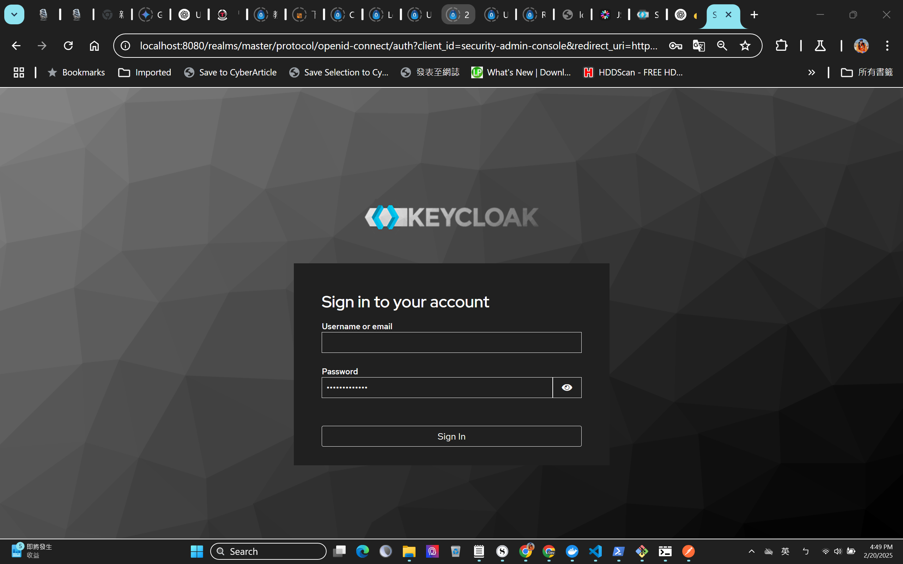
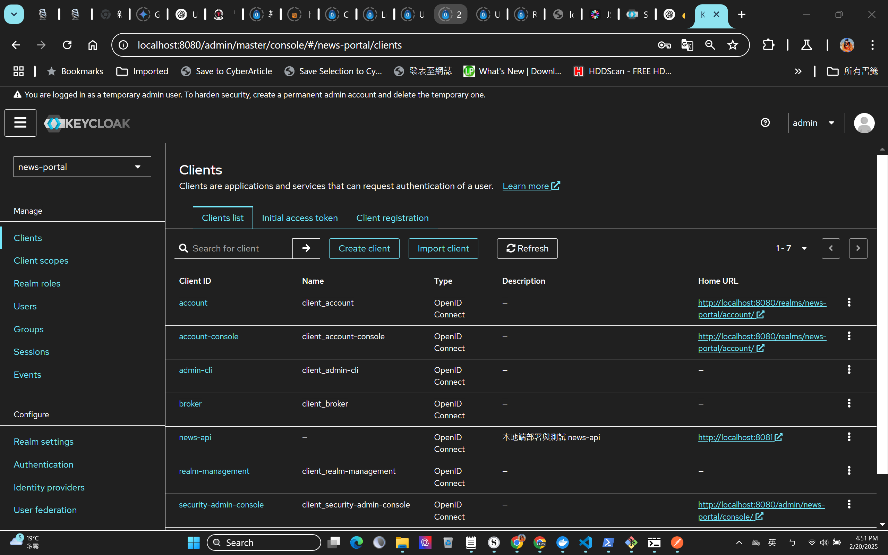

# Keycloak_SpringSecurity

📅 Keycloak / Spring Security 新聞應用程式 API 認證 開發計畫

🔥 這個計畫使用 Keycloak 和 Spring Security 來保護 REST API，並實作 OAuth 2.0 授權機制，以確保 API 的安全性並基於 RBAC（角色型存取控制） 來管理權限。

🏗️ 專案架構
這個新聞應用程式 API 包含 三大主要模組：
🎯Keycloak 身份驗證伺服器
🎯Spring Boot REST API
🎯 角色與權限控管（RBAC）

📌 技術棧
✅Java 17+ (開發語言)
✅Spring Boot 3.x (REST API 框架)
✅Spring Security 6.x (身分驗證與授權)
✅Keycloak 22+ (OAuth 2.0 認證與授權伺服器)
✅Docker (容器化 Keycloak 伺服器)
✅PostgreSQL （Keycloak 資料庫）
✅JWT (JSON Web Token) 存取令牌

